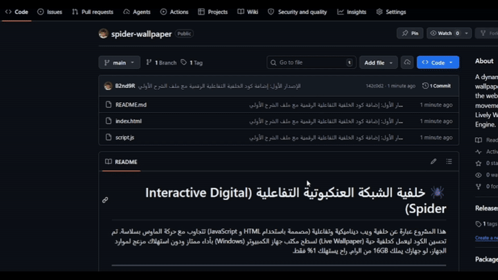
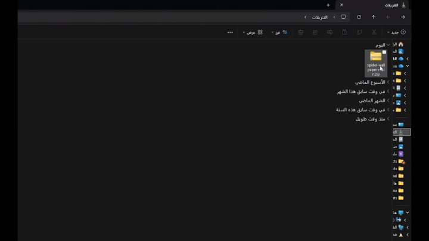
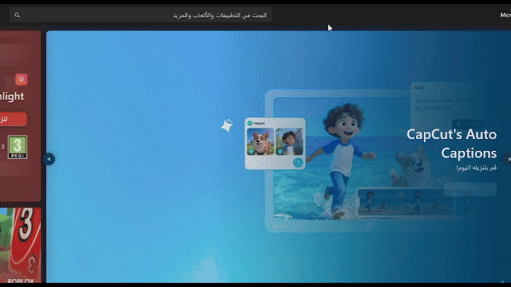

# 🕷️ خلفية الشبكة العنكبوتية التفاعلية (Interactive Digital Spider)

هذا المشروع عبارة عن خلفية ويب ديناميكية وتفاعلية (مصممة باستخدام HTML و JavaScript) تتجاوب مع حركة الماوس بسلاسة. تم تحسين الكود ليعمل كخلفية حية (Live Wallpaper) لسطح مكتب جهاز الكمبيوتر (Windows) بأداء ممتاز ودون استهلاك مزعج لموارد الجهاز، لو جهازك يملك 16GB من الرام, راح يستهلك 1% فقط.

---

## ⚙️ طريقة التركيب والتشغيل (خطوة بخطوة)

لكي تجعل هذا المشروع خلفية حية لشاشة الكمبيوتر الخاصة بك، يرجى اتباع الخطوات التالية بعناية:

### الخطوة الأولى: حفظ واستخراج الملفات 📂

1. **تحميل المشروع:** إذا قمت بتحميل هذا المشروع كملف مضغوط (`.zip`)، قم بنقله إلى مسار مألوف وواضح في جهازك لكي لا تفقده، وأفضل مكان هو مجلد **التنزيلات (Downloads)**.
   
   

2. **فك الضغط عن الملف:** 
   - اذهب إلى مجلد `Downloads`، وانقر بزر الماوس الأيمن على الملف المضغوط.
   - اختر **"استخراج الكل..." (Extract All...)**.
   - سينتج عن ذلك مجلد عادي يحتوي بداخله على ملفين أساسيين وهما: `index.html` و `script.js`.
   
   *(تنبيه هام: لا تحذف هذا المجلد أو تنقله لاحقاً بعد تشغيل الخلفية لكي لا تتعطل).*
   
   

### الخطوة الثانية: تنزيل برنامج Lively Wallpaper 📥

نحتاج إلى برنامج وسيط وخفيف لتشغيل هذا الكود كخلفية لسطح المكتب. نوصي بشدة باستخدام برنامج **Lively Wallpaper** لأنه مجاني ومفتوح المصدر ويوقف الخلفية تلقائياً عند اللعب للحفاظ على الأداء.

1. افتح **متجر مايكروسوفت (Microsoft Store)** في جهازك الويندوز.
2. ابحث عن **Lively Wallpaper** وقم بتثبيته وفتحه. (أو يمكنك تحميله مباشرة من [موقعهم الرسمي](https://rocksdanister.github.io/lively/)).
   
   

### الخطوة الثالثة: تفعيل الخلفية في البرنامج 🖥️

1. افتح برنامج **Lively Wallpaper**.
2. في واجهة البرنامج الرئيسية، ابحث عن علامة الزائد **(+)** أو زر **"Add Wallpaper"** (إضافة خلفية) واضغط عليه.
3. الآن، افتح نافذة المجلد الخاص بالمشروع (الذي استخرجناه قبل قليل في مجلد التنزيلات `Downloads`).
4. قم بـ **سحب ملف `index.html` بزر الماوس الأيمن وإفلاته (Drag & Drop)** داخل نافذة برنامج Lively Wallpaper.
   
   

5. ستظهر لك نافذة صغيرة تطلب منك تسمية الخلفية، اكتب اسماً مناسباً (مثل: *Interactive Spider*).
6. اضغط على زر **"OK"**.

🎉 **انتهى الشرح!**
الآن تم تطبيق الخلفية بنجاح على سطح مكتبك. جرّب تحريك الماوس في مساحة سطح المكتب لتشاهد كيف تتفاعل معك الشبكة الرقمية.